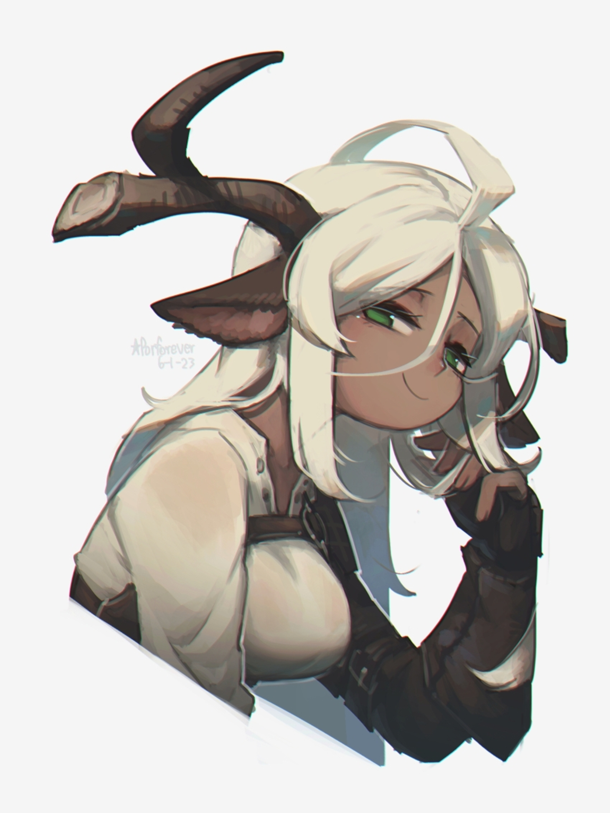

Sylvanix are known uniquely for their antlers of various sizes, where you would find the horns of a [Pyra](Pyra%20b6f6d8dd544a49fb8facfbf8b19b3263.md) or [Umbraleth](Umbraleth%204a154f46f9ba40ef8dfaf1fe562bb19d.md). They also have flat, seed-shaped ears, with a small, stubby tail.

