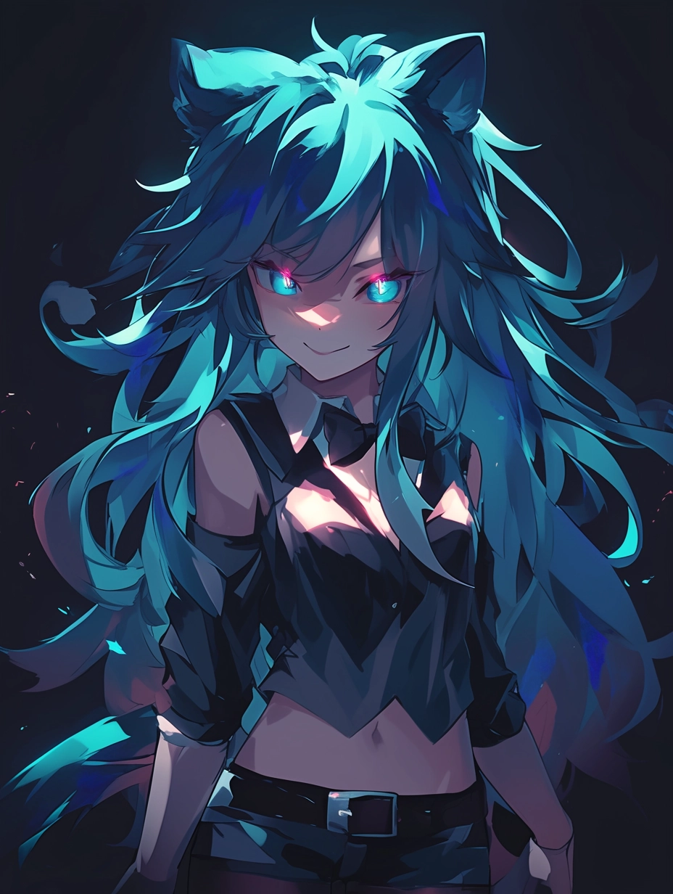

# Darkness

Attribute: Wit (../../Attributes%20c08539f2d2f647e094b002427c9c8cbb/Attributes%20ce0d6811d6304e19a48627f5caeb024c/Wit%2007393bd6de83466f8b33b8db78bd6099.md)

As darkness exists in the absence of light, the strength of darkness comes with the perceived absence of its users.

Darkness inflicts dread, confusion, and weakness in the form of illusions, delayed effects, and hidden traps for their enemies to stumble into.

This mode of operation isn't foolproof; some are smart or even lucky enough to survive the dark’s minefield of mind games, but many others aren't so fortunate.

“You’re sure you still wanna say silent? Something bad could happen if you don’t tell the truth. Not saying it will. Or am I? Who knows.” - Allison