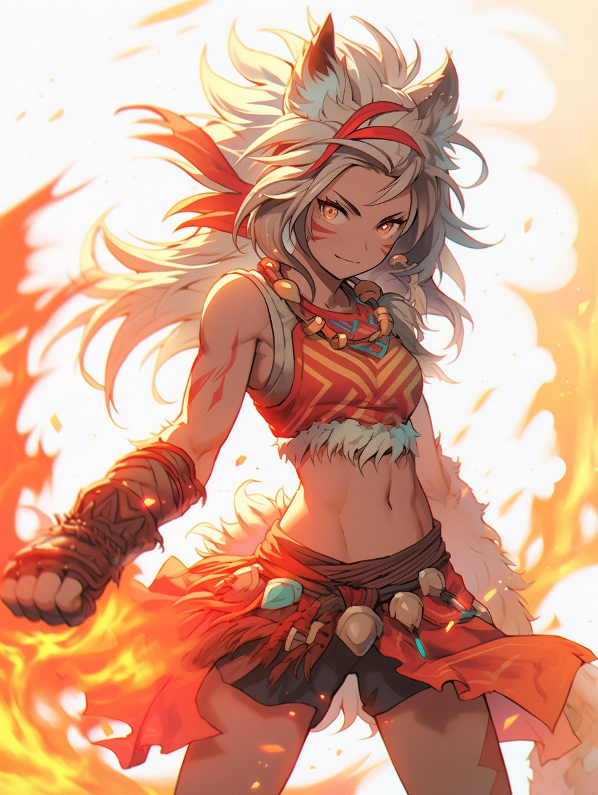

# Fire

Attribute: Strength (../../Attributes%20c08539f2d2f647e094b002427c9c8cbb/Attributes%20ce0d6811d6304e19a48627f5caeb024c/Strength%20c5022beff4db4de0badc641792975408.md)

Fire is the aspect of blind fury and relentless destruction. The end of dealing huge bursts of damage comes with the cost of taking chunks of that damage yourself.

Some are more careful with the way they use it, others less so, glad to take the not-so-small tax of a dozen burns to reduce the opposition to a crisp.

“If you want a fight, you’ve got one. Get your wimpy-looking ass over here!” - Winter