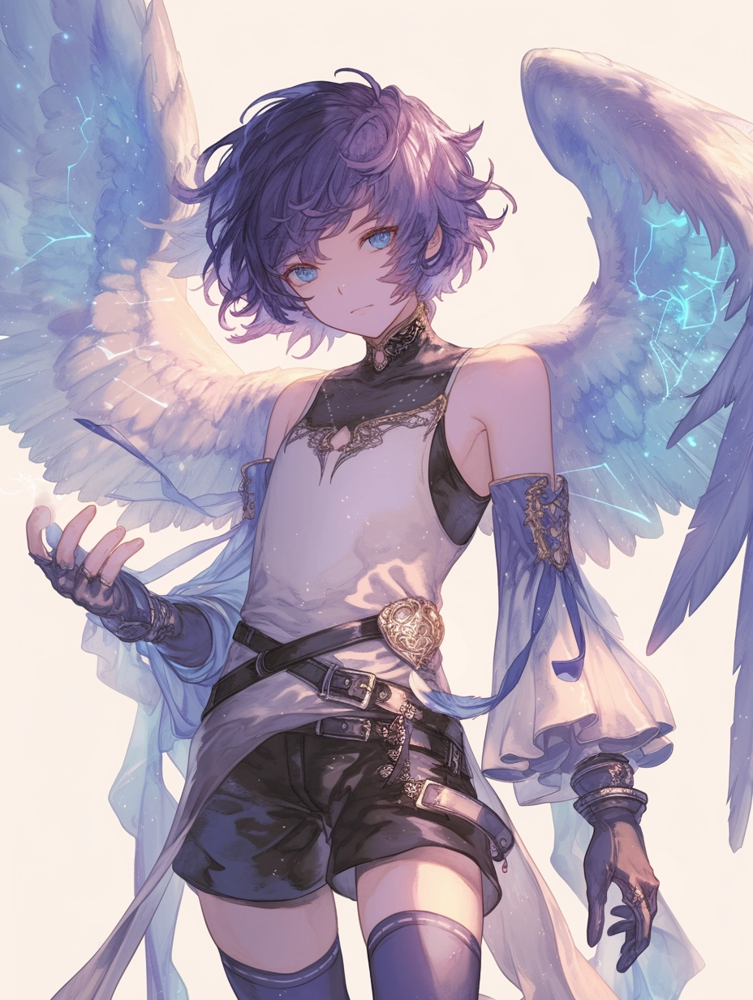

# Light

Attribute: Intellect (../../Attributes%20c08539f2d2f647e094b002427c9c8cbb/Attributes%20ce0d6811d6304e19a48627f5caeb024c/Intellect%20295b7ef15b5a463198445ac4b601d135.md)

The healing and recovery of light is an essential staple of any society. Eisenkind collectively have great respect and thankfulness towards those who work diligently to ensure the well-being of their comrades. 

Most of all, light users are seen as brave and selfless, as the strength of their light increases the more they exhaust themselves, almost always risking their own health to keep others standing.

“Don’t worry, I’ve got your back. I won’t let you fall, no matter what.” - Arthur