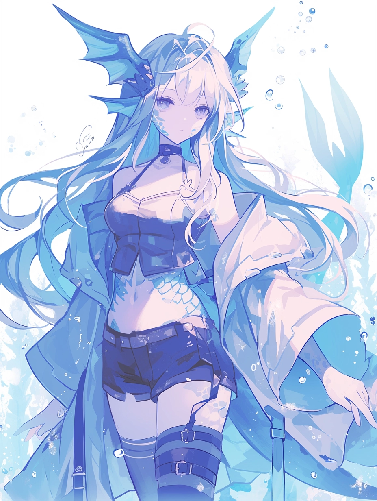

# Water

Attribute: Sense (../../Attributes%20c08539f2d2f647e094b002427c9c8cbb/Attributes%20ce0d6811d6304e19a48627f5caeb024c/Sense%206b1dd028ea494e1785d11d6c3c5753fc.md)

Water, ice, and mist all have great utility in everyday life, as well as more active scenarios like combat.

Water is best used defensively: creating barriers, obstacles, and smoke screens to make things harder for their enemies, or building bridges for their allies.

However, as evidenced by floods, tsunamis, typhoons, and other natural disasters, the indiscriminate nature of water requires great thought and care into where and how it's used.

“Sometimes, I like to sit in silence and listen to the waves cascade over the coast. It helps me clear my mind.” - Lirael
