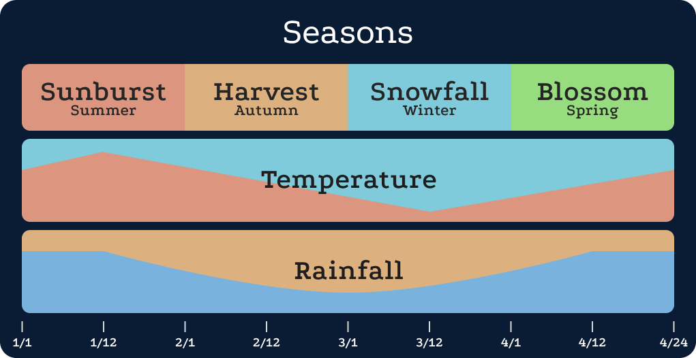

# Calendar

Throughout the history of Eisenwald, different regions used their own calendar systems, but as the world became more connected, communication and trade grew more difficult over time.

The Rosenfeld Standard Calendar won over a handful of other proposed calendar systems, having started its “day one” just a few decades ago.

A month is 24 days, divided into four 6-day weeks, and the year is four months, for a 96-day year.

The names of months are:

1. Sunburst (Summer)
2. Harvest (Fall)
3. Snowfall (Winter)
4. Blossom (Spring)

The format of dates is roughly “[Day] of [Month], Year [Year]”. Short format is [Year]/[Month]/[Day]. Example: 12th of Blossom, Year 21 • 21/4/12

The first half of the year is the warm season, the latter half is the cool season. The highest and lowest temperatures of the year come in the middle of the seasons, where it’s much more mild and temperate at the transitions.

