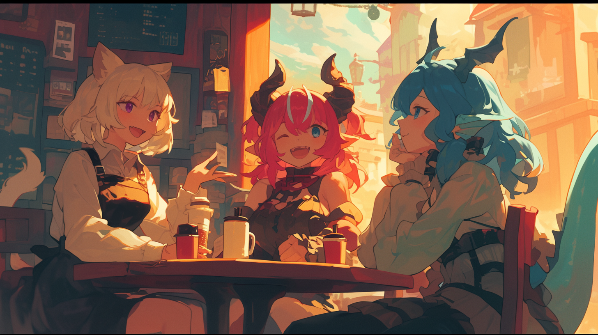

# Races of Eisenkind

Eisenwald is populated by human-like people, or **eisenkind**, with features of animals, such as dogs, cats, foxes, and birds, as well as other fantasy races like dragons and demons. Eisenkind exist in harmony alongside their races’ origin animals, as well as a breadth of other fanatical creatures and mixes thereof.

# Names

Eisenkind receive only a given name at birth, without any family name or last name, simply because the societal need for that hasn’t risen. The origins of these names can be categorized into a few main groups:

1. **Fantasy**: These names have an otherworldly sound and feel to them, inspired by fantasy and mythology.
    - Masculine examples: Castiel, Astraeus, Asmodai, Rurik, Fenrir, Lucian
    - Feminine examples: Euthalia, Lirael, Lysandra, Sylvia, Elysia, Lilith
    - Unisex examples: Aeris, Rowan, Lyric, Talon, Phoenix, Kael
2. **Nature**: These names have roots in the natural world, encompassing flora, fauna, seasons, celestial bodies, and other natural phenomena. For instance:
    - Masculine examples: Orion, August, Ash, Clay, Hawthorn, Forrest
    - Feminine examples: Lily, Summer, Luna, Amber, Aurora, Celeste
    - Unisex examples: River, Winter, Jupiter, Hazel, Robin, Storm
3. **Everyday**: These names are drawn from ordinary everyday objects or concepts that hold a special significance to the individual. This can be a favorite instrument, color, garment, a cherished item, or a comforting idea. Examples include:
    - Masculine examples: Jet, Oak, Jasper, Reed, Piano, Chip
    - Feminine examples: Scarlet, Viola, Garnet, Pearl, Velvet, Crystal
    - Unisex examples: Quill, Sage, Indigo, Echo, Scout, Rogue

# Custom Races

With eisenkind being as diverse as they are, some existing races may not fit into one of the predetermined categories.

When creating a character, you’re free to invent your own race and its abilities, as long as it fits the human-like theme of the others and you have approval from the GM.

You may also pick a more specific race, but choose the abilities from the closest one available. For example: felirians are based off of house cats by default, but a felirian character could be based on a lion, tiger, cheetah, jaguar, or any other feline animal. Likewise, a lizard-like character would probably fall under [Pyra](Races-of-Eisenkind/Races/Pyra.md).

[Races](Races-of-Eisenkind/Races.md)