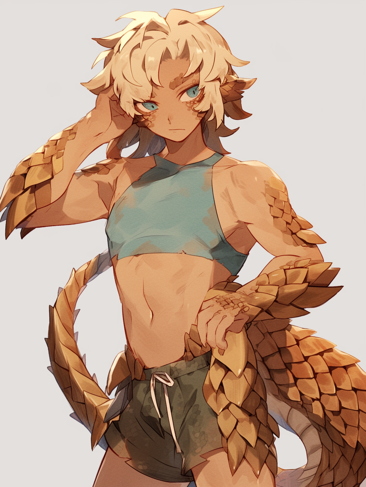

# Myrmadon

Abilities: Spelunker - When using Dash (../../General%20Skills%207e3cf34ee21e4a9198f205234d32b6cb/General%20Skills%202bc339d7bbc8432c9b15e12af7a2ba0b/Dash%2069749027d2064cbdb2761cf0385aab6f.md), you may burrow through dirt to roll with an extra die.
Claws - All strike rolls have +1 boost dice.
Protective Scales - Your damage threshold is increased by 10.

The Myrmadon race exhibits pangolin-like features: patches of thick scales that cover their body, a tail akin to that of [Pyra](Pyra.md), and/or tanned skin.

# Trivia

(todo)

# History

Myrmadon are one of the lesser seen races in Eisenwald. Many of them live in the Undergrowth, but they prefer to dig out their own isolated spaces separate from others.

A history of prejudice combined with their relatively long life spans left this race with lingering trust issues towards eisenkind of other races.

