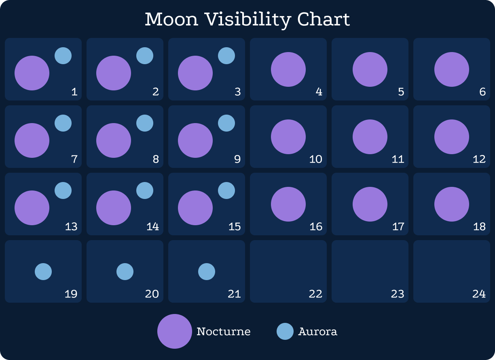

# Astronomy

Aurora and Nocturne are the sister moons that call Eisenwald home. Nocturne is a larger moon with a slower orbit. Aurora has a much faster cycle, so much so it can be seen slowly moving across the sky with the naked eye.

The weeks and months are aligned with the cycles of Aurora and Nocturne. Aurora is visible for the first three days of each week, and Nocturne is visible for the first three weeks of the month.

The world is much darker at night while Aurora and Nocturne are both set. This increases the likelihood of certain creatures being out and about.

