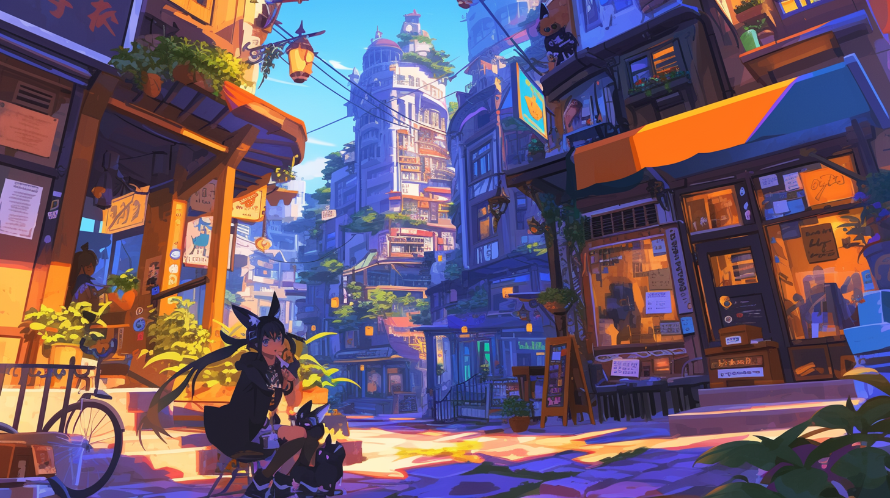

# Eisenwald

> _Once upon a time, there were two umbraleth sisters: Aurora and Nocturne. At their awakening, the only company they had were each other. Faced with the darkness and danger of the surrounding uninhabited wilderness, they needed to quell their fears and work to survive the unflinching dangers of the Outlands._
>
> _One day, the two felt a spark, a vague feeling that would allow them to follow the path to entangle themselves with the very nature of reality itself._
>
> _It started with manipulating water, making use of it in various ways, from offense, to protection, to healing and comfort. More experimentation led to more advanced techniques, such as turning water to ice and frost and embedding one's senses into the surrounding moisture in the air._
>
> _The two girls experimented further, moving from aspect to aspect, eventually landing on the five that Eisenkind are familiar with today: Fire, Water, Wind, Light, and Darkness._
>
> _Aurora and Nocturne made use of their new skills to fend off the dangers of the Outlands. They travelled across Eisenwald, meeting other people and saving as many as they could, while passing their knowledge to them as well._
>
> _A civilization naturally came out of this gathering of Eisenkind, growing more and more, gradually becoming safer and more prosperous as Eisenkind gained more aptitude in technology and aspect art._
>
> _Roses were Aurora’s favorite flower. Out of love, Nocturne wanted to give their safe haven a name: Rosenfeld._
>
> _After the passing of the two sisters, Eisenkind collectively named the two formerly unnamed moons after them. The older sister, Nocturne, became the larger moon, and the younger sister, Aurora, became the smaller moon._
>
> _But maybe that’s just a fairy tale._

Aspects of Nature takes place in **Eisenwald**, a world populated by numerous varieties of human-like people called **Eisenkind**, each possessing features of one of many animals.

The world's landscape is split into diverse, distinct regions, each spotted with cities and towns formed as safe havens from the surrounding outlands.

In terms of architecture, culture, food, and so on, cities in Eisenwald feel like a mix of familiar fantasy tropes and elements of modern society.

You’ll enter a walkable city with stone buildings and cobblestone streets filled with people dressed in colorful, stylish, and sometimes showy outfits. Spacious residential housings intermix with restaurants, clothing stores, marketplaces, and other businesses, many of which are self-run and unique to the town you’re in.
