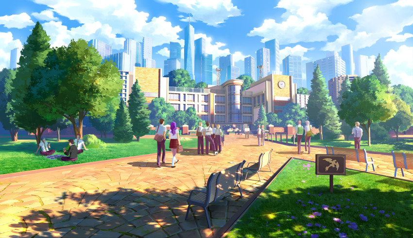

# Rosenfeld

Summary: The largest city in Eisenwald that sits comfortably between other regions, serving as a gateway between them.

](Rosenfeld%2056cc694ab54247dbbe1a1e65bb616480/Untitled.png)

[https://www.pixiv.net/artworks/112687098](https://www.pixiv.net/artworks/112687098)

Due to its size, wealth, and diversity, many call it the capital of the world, and travel here with the hope of starting a new life for themselves and their loved ones, seizing the opportunities within. Rosenfeld also acts as a safe haven from the potential dangers of the surrounding uninhabited wilds.

Travelling east, forests surrounding the path become progressively thicker, until the path itself eventually disappears into the depths of the [Whisperwood](Whisperwood.md).

To the north, one can venture through the open fields of the [Great Plains](Great-Plains.md) and its small and friendly dwellings before eventually reaching the [Frostwilds](Frostwilds.md).

Paths from the west side of Rosenfeld run past small neighbor settlements, eventually ending at the tall cliffs blanketing the gulf of [Azeurus](Azeurus.md), in which its namesake city resides.

The south cliffside of the city hosts the air ferry port that allows travel to and from [Aeropolis](Aeropolis.md). The cliff itself offers a downward path to the greenery below. As it continues, the comforting nature slowly transitions into the black, violent harshness surrounding [The Caldera](The-Caldera.md).

# Rosenfeld Academy

https://kevin_gnutzmans.artstation.com/projects/QnD988

> todo

# The Guildhall

> todo

# The Bazaar

> todo
