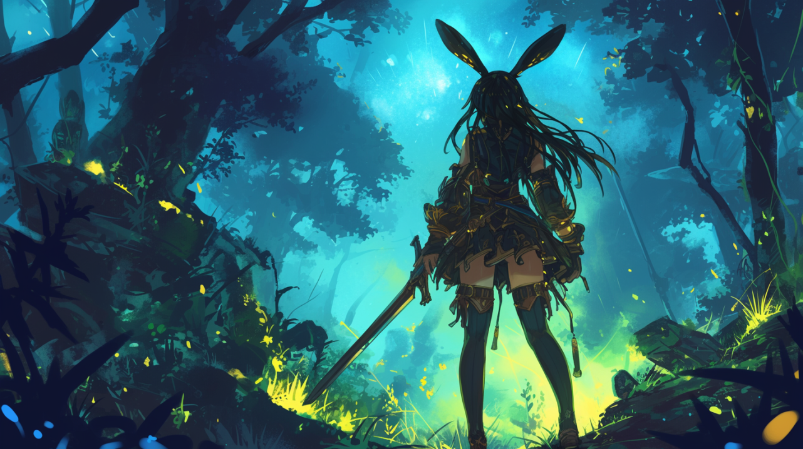

# The Outlands

The Outlands refer to the uncharted areas outside civilization populated by a wide variety of wildlife, ranging from friendly and harmless, to ferocious and monstrous.

Many were once taught from a young age to stay within the safe confines of their home. However, the more adventurous and brave few opt to risk their well-being and venture through anyways. Some do it to protect the ones they love, some do it to profit from valuable resources that can be found within, some for deeply personal reasons, and others just to brag and say they made it through.

Nowadays, advancements in technology, weaponry, medicine, navigation, and aspect art have made it easier for anyone who wishes to delve into the depths. Despite all that, mistakes can be, and often are, fatal.
