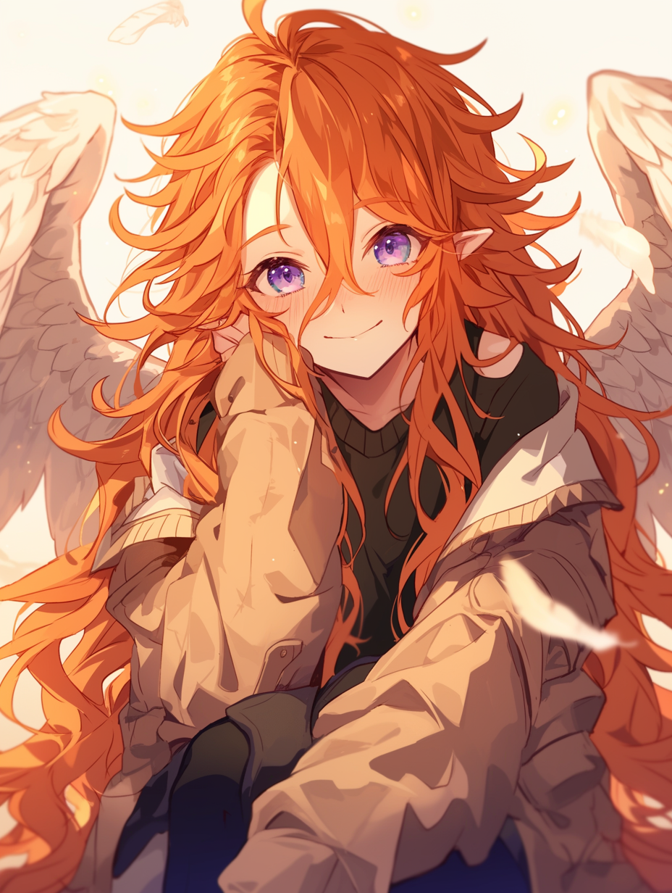

Aquilians exhibit bird-like features, such as feathered wings—either from the back and/or from the head—tails, and often, but not always having large, pointed ears.

# Trivia

- Aquilians get flak in some places for their tendency to shed feathers during the spring.
- Aquilians have developed their own language consisting of squaks and caws in various tones, intonations, and dialects.
- Some Aquilians are born without the ability to fly, but often possess other unique traits to make up for it. Still, it can be a sensitive topic for them.

# History

Compared to other races, Aquilians came about later in Eisenwald’s history. Boasting wings bigger than that of any other known race at the time, many uncertain eisenkind feared and avoided those of this race, leaving them isolated.

This led to Aquilians grouping together. Flight made them especially well-equipped to weather the dangers of the outlands, and they leveraged this power to build settlements of their own, the largest of which being [Aeropolis](https://www.notion.so/Aeropolis-621f327ef51643d8a2247e6c0d00d0a4?pvs=21).

Despite the treatment from other races, Aquilians acted kindly to outsiders and welcomed them into their spaces with no strings attached, protecting the weary and sharing their knowledge and technological advancements for the betterment of all eisenkind.

